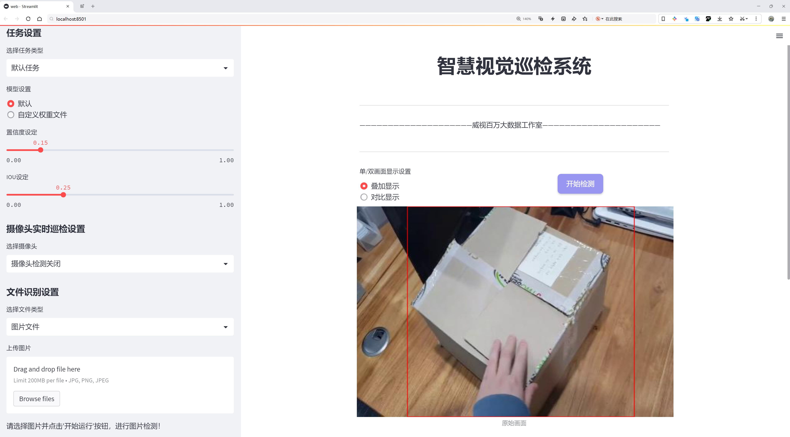
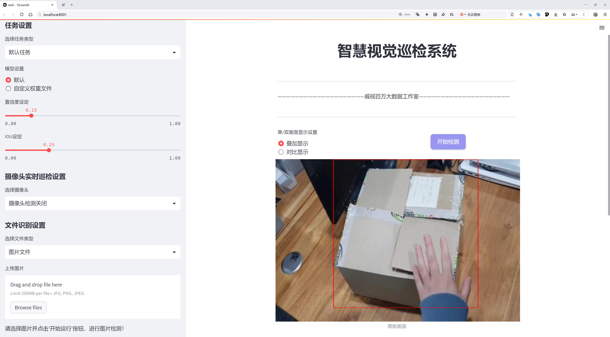
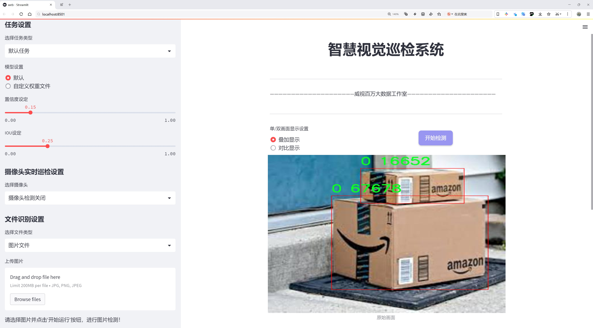
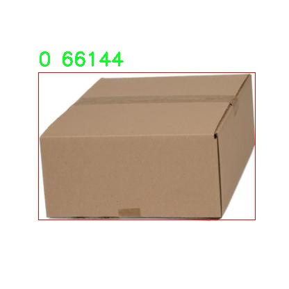
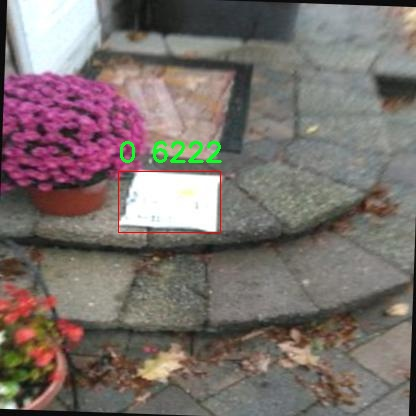
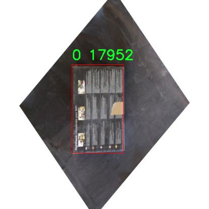
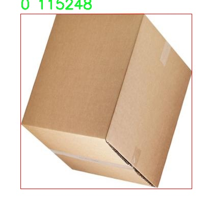
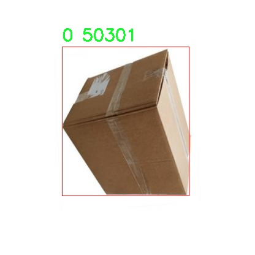

# 快递盒检测检测系统源码分享
 # [一条龙教学YOLOV8标注好的数据集一键训练_70+全套改进创新点发刊_Web前端展示]

### 1.研究背景与意义

项目参考[AAAI Association for the Advancement of Artificial Intelligence](https://gitee.com/qunmasj/projects)

项目来源[AACV Association for the Advancement of Computer Vision](https://kdocs.cn/l/cszuIiCKVNis)

研究背景与意义

随着电子商务的迅猛发展，快递行业也随之蓬勃兴起，快递包裹的数量日益增加。根据统计数据，全球快递市场的年增长率已超过10%，预计在未来几年内将继续保持这一增长趋势。在这一背景下，快递包裹的管理和处理效率成为了行业内亟待解决的重要问题。传统的快递包裹检测方法往往依赖人工操作，不仅效率低下，而且容易受到人为因素的影响，导致错误率较高。因此，基于计算机视觉的自动化检测系统应运而生，成为提升快递处理效率和准确性的重要手段。

在众多计算机视觉技术中，目标检测技术因其在实时性和准确性方面的优势，逐渐成为快递包裹检测的主流选择。YOLO（You Only Look Once）系列模型以其高效的特性受到广泛关注。YOLOv8作为该系列的最新版本，结合了深度学习的先进技术，能够在保持高精度的同时实现快速的目标检测。然而，尽管YOLOv8在多种应用场景中表现出色，但在特定领域如快递盒检测中，仍然存在一些挑战，例如对不同尺寸、形状和颜色的快递盒的识别能力，以及在复杂背景下的检测准确性等。因此，针对快递盒检测任务对YOLOv8进行改进和优化，具有重要的研究意义。

本研究所使用的数据集包含7815张图像，涵盖了四个类别的快递盒，分别为0、1、15和box。这一数据集的构建为模型的训练和评估提供了丰富的样本，能够有效支持目标检测算法的优化与改进。通过对数据集的深入分析，我们可以识别出快递盒在不同环境下的特征，进而针对性地调整YOLOv8的网络结构和参数设置，以提高其在快递盒检测中的表现。此外，数据集的多样性也为模型的泛化能力提供了保障，使其能够在实际应用中适应不同的快递场景。

本研究的意义不仅在于提升快递盒的检测精度和效率，更在于推动快递行业的智能化进程。通过引入先进的目标检测技术，我们可以实现快递包裹的自动化管理，降低人工成本，提高工作效率，进而为快递行业的可持续发展提供有力支持。同时，研究成果也将为其他领域的目标检测任务提供借鉴，推动计算机视觉技术的广泛应用。

综上所述，基于改进YOLOv8的快递盒检测系统的研究，不仅具有重要的理论价值，也具备显著的实际应用前景。通过深入探讨和优化目标检测技术，我们期待能够为快递行业的智能化转型贡献一份力量，同时为相关领域的研究提供新的思路和方法。

### 2.图片演示







##### 注意：由于此博客编辑较早，上面“2.图片演示”和“3.视频演示”展示的系统图片或者视频可能为老版本，新版本在老版本的基础上升级如下：（实际效果以升级的新版本为准）

  （1）适配了YOLOV8的“目标检测”模型和“实例分割”模型，通过加载相应的权重（.pt）文件即可自适应加载模型。

  （2）支持“图片识别”、“视频识别”、“摄像头实时识别”三种识别模式。

  （3）支持“图片识别”、“视频识别”、“摄像头实时识别”三种识别结果保存导出，解决手动导出（容易卡顿出现爆内存）存在的问题，识别完自动保存结果并导出到tempDir中。

  （4）支持Web前端系统中的标题、背景图等自定义修改，后面提供修改教程。

  另外本项目提供训练的数据集和训练教程,暂不提供权重文件（best.pt）,需要您按照教程进行训练后实现图片演示和Web前端界面演示的效果。

### 3.视频演示

[3.1 视频演示](https://www.bilibili.com/video/BV1qvxhe6EYp/)

### 4.数据集信息展示

##### 4.1 本项目数据集详细数据（类别数＆类别名）

nc: 4
names: ['0', '1', '15', 'box']


##### 4.2 本项目数据集信息介绍

数据集信息展示

在本研究中，我们使用了名为“1_box”的数据集，以改进YOLOv8的快递盒检测系统。该数据集专门为快递盒的检测任务而设计，包含了丰富的样本和多样的场景，旨在提高模型在实际应用中的准确性和鲁棒性。数据集的类别数量为四个，具体类别包括“0”、“1”、“15”和“box”。这些类别代表了不同类型的快递盒，涵盖了从常见的标准快递盒到特殊形状和尺寸的包装，确保了模型在多种情况下的有效性。

“1_box”数据集的构建经过精心设计，包含了大量的标注图像，涵盖了各种光照条件、背景环境和拍摄角度。这些图像不仅展示了快递盒的不同外观，还考虑了不同的遮挡情况和复杂的背景，以增强模型的泛化能力。数据集中的每一张图像都经过专业标注，确保了目标物体的准确定位和类别识别。这种高质量的标注数据为YOLOv8模型的训练提供了坚实的基础，使其能够在快递盒检测任务中实现更高的准确率。

在数据集的使用过程中，我们将其划分为训练集和验证集，以便于对模型的性能进行评估和调优。训练集包含了大部分样本，用于模型的学习和参数优化，而验证集则用于实时监测模型在未见数据上的表现。通过这种划分，我们能够有效地避免过拟合现象，确保模型在实际应用中的可靠性。

为了进一步提升模型的性能，我们还对数据集进行了数据增强处理。这包括图像的旋转、缩放、裁剪、翻转以及颜色调整等操作，以增加数据的多样性和丰富性。这种增强策略不仅提高了模型的鲁棒性，还帮助模型更好地适应不同的应用场景，例如在快递投递过程中可能遇到的各种复杂环境。

此外，数据集的设计也考虑到了快递行业的实际需求。随着电子商务的快速发展，快递盒的种类和形状日益多样化，因此“1_box”数据集的类别设置涵盖了常见的快递盒类型，使得训练出的模型能够有效应对市场上各种快递盒的检测需求。这一特性使得我们的快递盒检测系统在实际应用中具有较高的实用价值。

总之，“1_box”数据集为改进YOLOv8的快递盒检测系统提供了丰富的样本和高质量的标注，确保了模型的训练和评估过程的科学性和有效性。通过对数据集的合理利用，我们期望能够提升快递盒检测的准确性和效率，为快递行业的智能化发展贡献力量。











### 5.全套项目环境部署视频教程（零基础手把手教学）

[5.1 环境部署教程链接（零基础手把手教学）](https://www.ixigua.com/7404473917358506534?logTag=c807d0cbc21c0ef59de5)


[5.2 安装Python虚拟环境创建和依赖库安装视频教程链接（零基础手把手教学）](https://www.ixigua.com/7404474678003106304?logTag=1f1041108cd1f708b01a)

### 6.手把手YOLOV8训练视频教程（零基础小白有手就能学会）

[6.1 手把手YOLOV8训练视频教程（零基础小白有手就能学会）](https://www.ixigua.com/7404477157818401292?logTag=d31a2dfd1983c9668658)

### 7.70+种全套YOLOV8创新点代码加载调参视频教程（一键加载写好的改进模型的配置文件）

[7.1 70+种全套YOLOV8创新点代码加载调参视频教程（一键加载写好的改进模型的配置文件）](https://www.ixigua.com/7404478314661806627?logTag=29066f8288e3f4eea3a4)

### 8.70+种全套YOLOV8创新点原理讲解（非科班也可以轻松写刊发刊，V10版本正在科研待更新）

由于篇幅限制，每个创新点的具体原理讲解就不一一展开，具体见下列网址中的创新点对应子项目的技术原理博客网址【Blog】：


[8.1 70+种全套YOLOV8创新点原理讲解链接](https://gitee.com/qunmasj/good)

### 9.系统功能展示（检测对象为举例，实际内容以本项目数据集为准）

图9.1.系统支持检测结果表格显示

  图9.2.系统支持置信度和IOU阈值手动调节

  图9.3.系统支持自定义加载权重文件best.pt(需要你通过步骤5中训练获得)

  图9.4.系统支持摄像头实时识别

  图9.5.系统支持图片识别

  图9.6.系统支持视频识别

  图9.7.系统支持识别结果文件自动保存

  图9.8.系统支持Excel导出检测结果数据


### 10.原始YOLOV8算法原理

原始YOLOv8算法原理

YOLOv8（You Only Look Once version 8）是目标检测领域的一项重要进展，建立在前几代YOLO算法的基础上，尤其是YOLOv5和YOLOv7的核心思想。该算法通过引入新的架构和训练策略，旨在提升目标检测的精度和效率。YOLOv8的设计理念围绕着实时性和准确性展开，适用于各种复杂的视觉任务。

YOLOv8的网络结构可以分为三个主要部分：Backbone、Neck和Head。每个部分在整体目标检测过程中扮演着至关重要的角色。Backbone负责特征提取，Neck则负责特征融合，而Head则进行最终的目标检测和分类。

在Backbone部分，YOLOv8采用了一系列卷积和反卷积层，利用残差连接和瓶颈结构来减小网络的大小并提高性能。该部分的核心模块是C2模块，构成了YOLOv8的基础。具体而言，Backbone由5个CBS模块、4个C2f模块和1个快速空间金字塔池化（SPPF）模块组成。CBS模块通过卷积、归一化和SiLU激活函数的组合，有效提取图像中的特征，解决了反向传播过程中的梯度消失和梯度爆炸问题，从而提升了模型的收敛速度和效果。C2f模块则在YOLOv5的C3模块基础上进行了优化，采用了ELAN思想，增强了特征的重用性和梯度流动性。C2f模块通过分支结构，将特征图的深度信息与空间信息进行融合，确保了特征提取的全面性和准确性。

Neck部分采用了PAN-FPN（Path Aggregation Network - Feature Pyramid Network）结构，旨在通过多尺度特征融合技术，提升目标检测的性能和鲁棒性。通过将来自Backbone不同阶段的特征图进行融合，YOLOv8能够更好地捕捉不同尺度目标的信息。这种融合策略不仅提高了检测精度，还增强了模型对复杂场景的适应能力。Neck部分的设计使得高层特征与中层和浅层特征之间的连接更加紧密，确保了信息的充分流动。

在Head部分，YOLOv8采用了三个解耦检测头，分别负责不同尺度下的目标检测任务。每个检测头都包含一系列卷积层和反卷积层，用于生成最终的检测结果。YOLOv8的Head部分借鉴了YOLOX和YOLOv6的解耦头设计，取消了传统的objectness分支，通过边框回归和目标分类的组合，提升了检测的准确性和效率。该部分的输出特征图经过处理后，能够有效地进行目标的分类和定位。

YOLOv8的另一个显著特点是其损失函数的设计。算法采用了VFLLoss作为分类损失，并结合DFLLoss和CIoULoss来优化边界框的回归过程。这种损失函数的组合不仅提高了模型的训练效率，还增强了对小目标的检测能力，尤其是在样本不平衡的情况下。YOLOv8通过TaskAligned的Assigner匹配策略，进一步优化了样本匹配过程，使得训练更加高效。

此外，YOLOv8在数据预处理阶段也采用了YOLOv5的策略，包括马赛克增强、混合增强、空间扰动和颜色扰动等多种数据增强手段。这些增强策略能够有效提升模型的泛化能力，使其在面对不同场景和条件时，依然能够保持较高的检测精度。

总的来说，YOLOv8算法通过一系列创新和优化，提升了目标检测的性能。其轻量化的特征提取网络、有效的特征融合策略以及先进的损失函数设计，使得YOLOv8在实时性和准确性之间找到了良好的平衡。作为YOLO系列的最新版本，YOLOv8不仅继承了前几代算法的优点，还在此基础上进行了重要的改进，成为目标检测领域的又一重要里程碑。


### 11.项目核心源码讲解（再也不用担心看不懂代码逻辑）

#### 11.1 70+种YOLOv8算法改进源码大全和调试加载训练教程（非必要）\ultralytics\models\yolo\pose\val.py

以下是对给定代码的核心部分进行分析和详细注释的结果：

```python
# Ultralytics YOLO 🚀, AGPL-3.0 license

from pathlib import Path
import numpy as np
import torch
from ultralytics.models.yolo.detect import DetectionValidator
from ultralytics.utils import LOGGER, ops
from ultralytics.utils.metrics import PoseMetrics, box_iou, kpt_iou
from ultralytics.utils.plotting import output_to_target, plot_images

class PoseValidator(DetectionValidator):
    """
    PoseValidator类扩展了DetectionValidator类，用于基于姿态模型的验证。
    """

    def __init__(self, dataloader=None, save_dir=None, pbar=None, args=None, _callbacks=None):
        """初始化PoseValidator对象，设置自定义参数和属性。"""
        super().__init__(dataloader, save_dir, pbar, args, _callbacks)
        self.sigma = None  # 用于计算关键点的标准差
        self.kpt_shape = None  # 关键点的形状
        self.args.task = 'pose'  # 设置任务类型为姿态估计
        self.metrics = PoseMetrics(save_dir=self.save_dir, on_plot=self.on_plot)  # 初始化姿态度量
        if isinstance(self.args.device, str) and self.args.device.lower() == 'mps':
            LOGGER.warning("WARNING ⚠️ Apple MPS known Pose bug. Recommend 'device=cpu' for Pose models.")

    def preprocess(self, batch):
        """预处理批次数据，将关键点数据转换为浮点数并移动到设备上。"""
        batch = super().preprocess(batch)  # 调用父类的预处理方法
        batch['keypoints'] = batch['keypoints'].to(self.device).float()  # 转换关键点数据类型
        return batch

    def postprocess(self, preds):
        """应用非最大抑制，返回高置信度的检测结果。"""
        return ops.non_max_suppression(preds,
                                       self.args.conf,
                                       self.args.iou,
                                       labels=self.lb,
                                       multi_label=True,
                                       agnostic=self.args.single_cls,
                                       max_det=self.args.max_det,
                                       nc=self.nc)

    def init_metrics(self, model):
        """初始化YOLO模型的姿态估计度量。"""
        super().init_metrics(model)  # 调用父类的初始化方法
        self.kpt_shape = self.data['kpt_shape']  # 获取关键点形状
        is_pose = self.kpt_shape == [17, 3]  # 判断是否为姿态模型
        nkpt = self.kpt_shape[0]  # 关键点数量
        self.sigma = OKS_SIGMA if is_pose else np.ones(nkpt) / nkpt  # 设置标准差

    def update_metrics(self, preds, batch):
        """更新度量指标。"""
        for si, pred in enumerate(preds):
            idx = batch['batch_idx'] == si  # 获取当前批次的索引
            cls = batch['cls'][idx]  # 获取当前批次的类别
            bbox = batch['bboxes'][idx]  # 获取当前批次的边界框
            kpts = batch['keypoints'][idx]  # 获取当前批次的关键点
            nl, npr = cls.shape[0], pred.shape[0]  # 标签数量和预测数量
            nk = kpts.shape[1]  # 关键点数量
            shape = batch['ori_shape'][si]  # 原始图像形状
            correct_kpts = torch.zeros(npr, self.niou, dtype=torch.bool, device=self.device)  # 初始化正确关键点
            correct_bboxes = torch.zeros(npr, self.niou, dtype=torch.bool, device=self.device)  # 初始化正确边界框
            self.seen += 1  # 增加已处理的批次数

            if npr == 0:  # 如果没有预测
                if nl:
                    self.stats.append((correct_bboxes, correct_kpts, *torch.zeros((2, 0), device=self.device), cls.squeeze(-1)))
                continue

            # 处理预测
            if self.args.single_cls:
                pred[:, 5] = 0  # 如果是单类，设置类别为0
            predn = pred.clone()  # 克隆预测结果
            ops.scale_boxes(batch['img'][si].shape[1:], predn[:, :4], shape, ratio_pad=batch['ratio_pad'][si])  # 缩放边界框
            pred_kpts = predn[:, 6:].view(npr, nk, -1)  # 重塑关键点
            ops.scale_coords(batch['img'][si].shape[1:], pred_kpts, shape, ratio_pad=batch['ratio_pad'][si])  # 缩放关键点坐标

            # 评估
            if nl:
                height, width = batch['img'].shape[2:]  # 获取图像高度和宽度
                tbox = ops.xywh2xyxy(bbox) * torch.tensor((width, height, width, height), device=self.device)  # 目标边界框
                ops.scale_boxes(batch['img'][si].shape[1:], tbox, shape, ratio_pad=batch['ratio_pad'][si])  # 缩放目标边界框
                tkpts = kpts.clone()  # 克隆关键点
                tkpts[..., 0] *= width  # 缩放x坐标
                tkpts[..., 1] *= height  # 缩放y坐标
                tkpts = ops.scale_coords(batch['img'][si].shape[1:], tkpts, shape, ratio_pad=batch['ratio_pad'][si])  # 缩放关键点坐标
                labelsn = torch.cat((cls, tbox), 1)  # 合并类别和边界框
                correct_bboxes = self._process_batch(predn[:, :6], labelsn)  # 处理边界框
                correct_kpts = self._process_batch(predn[:, :6], labelsn, pred_kpts, tkpts)  # 处理关键点

            # 记录统计信息
            self.stats.append((correct_bboxes, correct_kpts, pred[:, 4], pred[:, 5], cls.squeeze(-1)))

    def _process_batch(self, detections, labels, pred_kpts=None, gt_kpts=None):
        """
        返回正确的预测矩阵。

        参数:
            detections (torch.Tensor): 形状为[N, 6]的检测张量。
            labels (torch.Tensor): 形状为[M, 5]的标签张量。
            pred_kpts (torch.Tensor, 可选): 形状为[N, 51]的预测关键点张量。
            gt_kpts (torch.Tensor, 可选): 形状为[N, 51]的真实关键点张量。

        返回:
            torch.Tensor: 形状为[N, 10]的正确预测矩阵。
        """
        if pred_kpts is not None and gt_kpts is not None:
            area = ops.xyxy2xywh(labels[:, 1:])[:, 2:].prod(1) * 0.53  # 计算面积
            iou = kpt_iou(gt_kpts, pred_kpts, sigma=self.sigma, area=area)  # 计算关键点的IoU
        else:  # 处理边界框
            iou = box_iou(labels[:, 1:], detections[:, :4])  # 计算边界框的IoU

        return self.match_predictions(detections[:, 5], labels[:, 0], iou)  # 匹配预测

    def plot_val_samples(self, batch, ni):
        """绘制并保存验证集样本及其预测的边界框和关键点。"""
        plot_images(batch['img'],
                    batch['batch_idx'],
                    batch['cls'].squeeze(-1),
                    batch['bboxes'],
                    kpts=batch['keypoints'],
                    paths=batch['im_file'],
                    fname=self.save_dir / f'val_batch{ni}_labels.jpg',
                    names=self.names,
                    on_plot=self.on_plot)

    def plot_predictions(self, batch, preds, ni):
        """绘制YOLO模型的预测结果。"""
        pred_kpts = torch.cat([p[:, 6:].view(-1, *self.kpt_shape) for p in preds], 0)  # 合并所有预测的关键点
        plot_images(batch['img'],
                    *output_to_target(preds, max_det=self.args.max_det),
                    kpts=pred_kpts,
                    paths=batch['im_file'],
                    fname=self.save_dir / f'val_batch{ni}_pred.jpg',
                    names=self.names,
                    on_plot=self.on_plot)  # 绘制预测结果

    def pred_to_json(self, predn, filename):
        """将YOLO预测结果转换为COCO JSON格式。"""
        stem = Path(filename).stem
        image_id = int(stem) if stem.isnumeric() else stem  # 获取图像ID
        box = ops.xyxy2xywh(predn[:, :4])  # 转换为xywh格式
        box[:, :2] -= box[:, 2:] / 2  # 将中心坐标转换为左上角坐标
        for p, b in zip(predn.tolist(), box.tolist()):
            self.jdict.append({
                'image_id': image_id,
                'category_id': self.class_map[int(p[5])],
                'bbox': [round(x, 3) for x in b],
                'keypoints': p[6:],
                'score': round(p[4], 5)})

    def eval_json(self, stats):
        """使用COCO JSON格式评估目标检测模型。"""
        if self.args.save_json and self.is_coco and len(self.jdict):
            anno_json = self.data['path'] / 'annotations/person_keypoints_val2017.json'  # 注释文件路径
            pred_json = self.save_dir / 'predictions.json'  # 预测结果文件路径
            LOGGER.info(f'\nEvaluating pycocotools mAP using {pred_json} and {anno_json}...')
            try:
                check_requirements('pycocotools>=2.0.6')  # 检查pycocotools的版本
                from pycocotools.coco import COCO  # 导入COCO API
                from pycocotools.cocoeval import COCOeval  # 导入COCO评估API

                for x in anno_json, pred_json:
                    assert x.is_file(), f'{x} file not found'  # 确保文件存在
                anno = COCO(str(anno_json))  # 初始化注释API
                pred = anno.loadRes(str(pred_json))  # 初始化预测API
                for i, eval in enumerate([COCOeval(anno, pred, 'bbox'), COCOeval(anno, pred, 'keypoints')]):
                    if self.is_coco:
                        eval.params.imgIds = [int(Path(x).stem) for x in self.dataloader.dataset.im_files]  # 设置评估图像ID
                    eval.evaluate()  # 评估
                    eval.accumulate()  # 累积结果
                    eval.summarize()  # 总结结果
                    idx = i * 4 + 2
                    stats[self.metrics.keys[idx + 1]], stats[self.metrics.keys[idx]] = eval.stats[:2]  # 更新mAP
            except Exception as e:
                LOGGER.warning(f'pycocotools unable to run: {e}')  # 捕获异常并记录警告
        return stats  # 返回统计信息
```

### 代码核心部分分析
1. **PoseValidator类**: 该类继承自`DetectionValidator`，用于处理姿态估计的验证。
2. **初始化方法**: 在初始化中设置了一些重要的参数，如`task`类型、`metrics`等，并检查设备类型。
3. **预处理和后处理**: `preprocess`方法用于处理输入数据，`postprocess`方法用于应用非最大抑制以过滤低置信度的检测结果。
4. **度量更新**: `update_metrics`方法负责更新检测的度量指标，包括边界框和关键点的匹配。
5. **绘图方法**: `plot_val_samples`和`plot_predictions`方法用于可视化验证集样本和模型预测结果。
6. **JSON转换**: `pred_to_json`和`eval_json`方法用于将预测结果转换为COCO格式，并评估模型性能。

这些核心部分共同构成了姿态估计模型验证的主要流程，涵盖了数据处理、模型评估和结果可视化等关键环节。

该文件是一个用于YOLOv8模型姿态估计的验证器类`PoseValidator`的实现，继承自`DetectionValidator`类。该类主要用于在姿态估计任务中评估模型的性能。代码中包含了多个方法和属性，下面是对其功能的逐步分析。

首先，类的构造函数`__init__`初始化了一些基本参数，包括数据加载器、保存目录、进度条、参数和回调函数。它还设置了任务类型为“pose”，并初始化了姿态估计的度量指标。若设备为Apple的MPS，系统会发出警告，建议使用CPU进行姿态模型的训练。

在`preprocess`方法中，输入的批次数据被处理，将关键点数据转换为浮点数并移动到指定设备上。`get_desc`方法返回一个字符串，描述了评估指标的格式。

`postprocess`方法应用非极大值抑制，返回具有高置信度分数的检测结果。`init_metrics`方法初始化姿态估计的度量指标，检查关键点的形状并设置相应的sigma值。

`update_metrics`方法用于更新模型的评估指标。它处理每个预测结果，计算正确的关键点和边界框，并将结果添加到统计信息中。如果需要，还可以将预测结果保存为JSON格式。

`_process_batch`方法用于处理检测和标签，计算IoU（交并比）并返回正确的预测矩阵。该方法支持关键点和边界框的处理。

`plot_val_samples`和`plot_predictions`方法用于绘制验证集样本和模型的预测结果，保存为图像文件。`pred_to_json`方法将YOLO的预测结果转换为COCO格式的JSON，以便后续评估。

最后，`eval_json`方法使用COCO格式的JSON评估对象检测模型的性能，计算mAP（平均精度均值）等指标，并输出评估结果。

整体来看，该文件实现了YOLOv8姿态估计模型的验证过程，涵盖了数据预处理、指标计算、结果可视化和评估等多个方面，适用于姿态估计任务的模型性能评估。

#### 11.2 70+种YOLOv8算法改进源码大全和调试加载训练教程（非必要）\ultralytics\nn\extra_modules\orepa.py

以下是代码中最核心的部分，并附上详细的中文注释：

```python
import torch
import torch.nn as nn
import torch.nn.functional as F
import numpy as np

# 定义一个名为OREPA的卷积模块
class OREPA(nn.Module):
    def __init__(self, in_channels, out_channels, kernel_size=3, stride=1, padding=None, groups=1, dilation=1, act=True):
        super(OREPA, self).__init__()
        
        # 初始化输入输出通道、卷积核大小、步幅、填充、分组和扩张
        self.in_channels = in_channels
        self.out_channels = out_channels
        self.kernel_size = kernel_size
        self.stride = stride
        self.padding = padding if padding is not None else (kernel_size // 2)
        self.groups = groups
        self.dilation = dilation
        
        # 激活函数的选择
        self.nonlinear = nn.ReLU() if act else nn.Identity()
        
        # 定义卷积层的权重参数
        self.weight_orepa_origin = nn.Parameter(torch.Tensor(out_channels, in_channels // groups, kernel_size, kernel_size))
        nn.init.kaiming_uniform_(self.weight_orepa_origin)  # 使用He初始化
        
        # 定义其他卷积层的权重参数
        self.weight_orepa_avg_conv = nn.Parameter(torch.Tensor(out_channels, in_channels // groups, 1, 1))
        nn.init.kaiming_uniform_(self.weight_orepa_avg_conv)
        
        self.weight_orepa_1x1 = nn.Parameter(torch.Tensor(out_channels, in_channels // groups, 1, 1))
        nn.init.kaiming_uniform_(self.weight_orepa_1x1)

        # 其他初始化代码省略...

    def weight_gen(self):
        # 生成最终的卷积权重
        weight_orepa_origin = self.weight_orepa_origin  # 原始卷积权重
        weight_orepa_avg = self.weight_orepa_avg_conv  # 平均卷积权重
        weight_orepa_1x1 = self.weight_orepa_1x1  # 1x1卷积权重
        
        # 将所有权重结合
        weight = weight_orepa_origin + weight_orepa_avg + weight_orepa_1x1
        return weight

    def forward(self, inputs):
        # 前向传播
        weight = self.weight_gen()  # 生成权重
        out = F.conv2d(inputs, weight, stride=self.stride, padding=self.padding, dilation=self.dilation, groups=self.groups)  # 卷积操作
        return self.nonlinear(out)  # 激活函数

# 其他类的定义省略...
```

### 代码说明：
1. **OREPA类**：这是一个自定义的卷积模块，继承自`nn.Module`。它包含多个卷积层的权重参数，使用不同的初始化方法。
2. **初始化方法**：在`__init__`中，定义了输入输出通道、卷积核大小、步幅、填充、分组和扩张等参数，并初始化卷积层的权重。
3. **权重生成**：`weight_gen`方法用于生成最终的卷积权重，将不同来源的权重结合起来。
4. **前向传播**：`forward`方法实现了前向传播过程，调用生成的权重进行卷积操作，并应用激活函数。

以上是代码的核心部分及其详细注释，帮助理解该模块的结构和功能。

这个程序文件包含了多个类和函数，主要用于实现一种名为OREPA（Optimized Reparameterization for Efficient Convolution）的卷积模块，旨在提高卷积神经网络的性能和效率。以下是对代码的详细说明。

首先，导入了必要的库，包括PyTorch的核心库、数学库、NumPy以及一些自定义的模块。`transI_fusebn`和`transVI_multiscale`是两个辅助函数，前者用于将卷积核和批归一化层的参数融合，后者用于对卷积核进行多尺度填充。

`OREPA`类是核心类之一，继承自`nn.Module`。在初始化方法中，定义了输入和输出通道、卷积核大小、步幅、填充、分组、扩张等参数。根据是否处于部署模式，初始化不同的卷积层和参数。该类的设计允许通过不同的分支组合生成卷积权重，利用了多个卷积核和批归一化的组合，以提高模型的表达能力。

`weight_gen`方法用于生成最终的卷积权重，通过对不同分支的权重进行加权求和，形成最终的卷积核。`forward`方法实现了前向传播，计算输入数据的卷积结果，并通过非线性激活函数和批归一化层进行处理。

`OREPA_LargeConv`类实现了一个大型卷积模块，支持更大的卷积核。它的结构与`OREPA`类似，但增加了多个卷积层的组合，能够处理更复杂的特征提取任务。

`ConvBN`类则是一个简单的卷积加批归一化模块，支持在部署模式下直接使用融合后的卷积核。

`OREPA_3x3_RepVGG`类是一个特定的OREPA模块，专门用于3x3卷积核的情况，支持不同的分支组合以生成卷积权重。

最后，`RepVGGBlock_OREPA`类实现了一个完整的块结构，结合了OREPA模块和1x1卷积层，能够处理输入数据并输出特征图。该类还支持SE（Squeeze-and-Excitation）注意力机制的集成，以进一步增强特征表示能力。

总体来说，这个文件实现了一种高效的卷积神经网络模块，能够通过不同的参数组合和结构设计，提升模型的性能和灵活性，适用于各种计算机视觉任务。

#### 11.3 ui.py

以下是代码中最核心的部分，并附上详细的中文注释：

```python
import sys
import subprocess

def run_script(script_path):
    """
    使用当前 Python 环境运行指定的脚本。

    Args:
        script_path (str): 要运行的脚本路径

    Returns:
        None
    """
    # 获取当前 Python 解释器的路径
    python_path = sys.executable

    # 构建运行命令，使用 streamlit 运行指定的脚本
    command = f'"{python_path}" -m streamlit run "{script_path}"'

    # 执行命令
    result = subprocess.run(command, shell=True)
    # 检查命令执行的返回码，如果不为0，表示执行出错
    if result.returncode != 0:
        print("脚本运行出错。")

# 实例化并运行应用
if __name__ == "__main__":
    # 指定要运行的脚本路径
    script_path = "web.py"  # 假设脚本在当前目录下

    # 调用函数运行脚本
    run_script(script_path)
```

### 代码注释说明：
1. **导入模块**：
   - `sys`：用于访问与 Python 解释器紧密相关的变量和函数。
   - `subprocess`：用于执行外部命令和与其交互。

2. **`run_script` 函数**：
   - 定义一个函数，接受一个参数 `script_path`，表示要运行的 Python 脚本的路径。
   - 使用 `sys.executable` 获取当前 Python 解释器的路径，以确保使用相同的环境来运行脚本。
   - 构建一个命令字符串，使用 `streamlit` 模块运行指定的脚本。
   - 使用 `subprocess.run` 执行构建的命令，并通过 `shell=True` 允许在 shell 中执行命令。
   - 检查命令的返回码，如果返回码不为0，表示执行过程中出现错误，打印错误信息。

3. **主程序块**：
   - 在 `if __name__ == "__main__":` 块中，确保只有在直接运行该脚本时才会执行以下代码。
   - 指定要运行的脚本路径为 `web.py`，并调用 `run_script` 函数来执行该脚本。

这个程序文件名为 `ui.py`，其主要功能是通过当前的 Python 环境运行一个指定的脚本，具体是一个名为 `web.py` 的文件。程序首先导入了必要的模块，包括 `sys`、`os` 和 `subprocess`，以及一个自定义的路径处理模块 `abs_path`。

在 `run_script` 函数中，程序接受一个参数 `script_path`，该参数是要运行的脚本的路径。函数首先获取当前 Python 解释器的路径，这通过 `sys.executable` 实现。接着，程序构建了一个命令字符串，该命令用于运行 `streamlit`，这是一个用于构建数据应用的库。命令的格式是将 Python 解释器与 `-m streamlit run` 结合使用，并传入要运行的脚本路径。

随后，程序使用 `subprocess.run` 方法执行构建好的命令。这个方法会在新的子进程中运行命令，并等待其完成。如果命令执行的返回码不为零，表示脚本运行出错，程序会输出一条错误信息。

在文件的最后部分，程序通过 `if __name__ == "__main__":` 语句来确保只有在直接运行该文件时才会执行以下代码。它指定了要运行的脚本路径为 `web.py`，并调用 `run_script` 函数来执行这个脚本。

总体来说，这个程序的目的是提供一个简单的接口来运行一个特定的 Python 脚本，并在运行过程中处理可能出现的错误。

#### 11.4 train.py

以下是经过简化和注释的核心代码部分：

```python
import random
import numpy as np
import torch.nn as nn
from ultralytics.data import build_dataloader, build_yolo_dataset
from ultralytics.engine.trainer import BaseTrainer
from ultralytics.models import yolo
from ultralytics.nn.tasks import DetectionModel
from ultralytics.utils import LOGGER, RANK
from ultralytics.utils.torch_utils import de_parallel, torch_distributed_zero_first

class DetectionTrainer(BaseTrainer):
    """
    扩展自 BaseTrainer 类，用于基于检测模型的训练。
    """

    def build_dataset(self, img_path, mode="train", batch=None):
        """
        构建 YOLO 数据集。

        参数:
            img_path (str): 包含图像的文件夹路径。
            mode (str): 模式为 `train` 或 `val`，用户可以为每种模式自定义不同的增强。
            batch (int, optional): 批次大小，仅用于 `rect` 模式。默认为 None。
        """
        gs = max(int(de_parallel(self.model).stride.max() if self.model else 0), 32)  # 获取模型的最大步幅
        return build_yolo_dataset(self.args, img_path, batch, self.data, mode=mode, rect=mode == "val", stride=gs)

    def get_dataloader(self, dataset_path, batch_size=16, rank=0, mode="train"):
        """构造并返回数据加载器。"""
        assert mode in ["train", "val"]  # 确保模式有效
        with torch_distributed_zero_first(rank):  # 仅在 DDP 时初始化数据集 *.cache 一次
            dataset = self.build_dataset(dataset_path, mode, batch_size)  # 构建数据集
        shuffle = mode == "train"  # 训练模式下打乱数据
        workers = self.args.workers if mode == "train" else self.args.workers * 2  # 根据模式设置工作线程数
        return build_dataloader(dataset, batch_size, workers, shuffle, rank)  # 返回数据加载器

    def preprocess_batch(self, batch):
        """对一批图像进行预处理，包括缩放和转换为浮点数。"""
        batch["img"] = batch["img"].to(self.device, non_blocking=True).float() / 255  # 转换为浮点数并归一化
        if self.args.multi_scale:  # 如果启用多尺度
            imgs = batch["img"]
            sz = (
                random.randrange(self.args.imgsz * 0.5, self.args.imgsz * 1.5 + self.stride)
                // self.stride
                * self.stride
            )  # 随机选择图像大小
            sf = sz / max(imgs.shape[2:])  # 计算缩放因子
            if sf != 1:
                ns = [
                    math.ceil(x * sf / self.stride) * self.stride for x in imgs.shape[2:]
                ]  # 计算新的形状
                imgs = nn.functional.interpolate(imgs, size=ns, mode="bilinear", align_corners=False)  # 进行插值缩放
            batch["img"] = imgs  # 更新图像
        return batch

    def get_model(self, cfg=None, weights=None, verbose=True):
        """返回 YOLO 检测模型。"""
        model = DetectionModel(cfg, nc=self.data["nc"], verbose=verbose and RANK == -1)  # 创建检测模型
        if weights:
            model.load(weights)  # 加载权重
        return model

    def plot_training_samples(self, batch, ni):
        """绘制带有注释的训练样本。"""
        plot_images(
            images=batch["img"],
            batch_idx=batch["batch_idx"],
            cls=batch["cls"].squeeze(-1),
            bboxes=batch["bboxes"],
            paths=batch["im_file"],
            fname=self.save_dir / f"train_batch{ni}.jpg",
            on_plot=self.on_plot,
        )

    def plot_metrics(self):
        """从 CSV 文件中绘制指标。"""
        plot_results(file=self.csv, on_plot=self.on_plot)  # 保存结果图
```

### 代码说明：
1. **DetectionTrainer 类**：继承自 `BaseTrainer`，用于实现 YOLO 模型的训练。
2. **build_dataset 方法**：根据给定的图像路径和模式构建数据集，支持训练和验证模式。
3. **get_dataloader 方法**：构造数据加载器，确保在分布式训练时只初始化一次数据集。
4. **preprocess_batch 方法**：对输入的图像批次进行预处理，包括归一化和多尺度调整。
5. **get_model 方法**：返回一个 YOLO 检测模型，可以选择加载预训练权重。
6. **plot_training_samples 方法**：绘制训练样本及其注释，便于可视化训练过程。
7. **plot_metrics 方法**：从 CSV 文件中绘制训练指标，便于监控训练效果。

这个程序文件 `train.py` 是一个用于训练目标检测模型的脚本，主要基于 YOLO（You Only Look Once）架构。它继承自 `BaseTrainer` 类，提供了一系列方法来构建数据集、加载数据、预处理图像、设置模型属性、获取模型、验证模型、记录损失、显示训练进度以及绘制训练样本和指标。

首先，文件中导入了一些必要的库和模块，包括数学运算、随机数生成、深度学习相关的库（如 PyTorch），以及一些来自 `ultralytics` 的模块，这些模块提供了数据处理、模型构建和训练的功能。

`DetectionTrainer` 类是该文件的核心，负责管理训练过程。它包含多个方法，其中 `build_dataset` 方法用于构建 YOLO 数据集，支持训练和验证模式，并允许用户自定义不同的增强方式。`get_dataloader` 方法则构建并返回数据加载器，确保在分布式训练时只初始化一次数据集，并根据模式选择是否打乱数据。

在图像预处理方面，`preprocess_batch` 方法负责将图像缩放并转换为浮点数格式，支持多尺度训练，确保输入图像的尺寸适合模型。`set_model_attributes` 方法则用于设置模型的属性，如类别数量和类别名称。

`get_model` 方法返回一个 YOLO 检测模型，并可选择加载预训练权重。`get_validator` 方法返回一个用于模型验证的对象，帮助评估模型性能。

在训练过程中，`label_loss_items` 方法用于返回带标签的损失字典，`progress_string` 方法格式化训练进度信息，便于监控训练状态。`plot_training_samples` 和 `plot_training_labels` 方法则用于可视化训练样本及其标注，帮助用户直观了解训练数据的情况。

最后，`plot_metrics` 方法从 CSV 文件中绘制训练指标，提供了训练过程中的性能反馈。整体来看，这个文件实现了一个完整的目标检测模型训练框架，涵盖了数据处理、模型训练和结果可视化等多个方面。

#### 11.5 70+种YOLOv8算法改进源码大全和调试加载训练教程（非必要）\ultralytics\nn\backbone\repvit.py

以下是代码中最核心的部分，并附上详细的中文注释：

```python
import torch.nn as nn
import torch

class Conv2d_BN(torch.nn.Sequential):
    """
    定义一个包含卷积层和批归一化层的模块
    """
    def __init__(self, a, b, ks=1, stride=1, pad=0, dilation=1,
                 groups=1, bn_weight_init=1):
        super().__init__()
        # 添加卷积层
        self.add_module('c', torch.nn.Conv2d(
            a, b, ks, stride, pad, dilation, groups, bias=False))
        # 添加批归一化层
        self.add_module('bn', torch.nn.BatchNorm2d(b))
        # 初始化批归一化层的权重
        torch.nn.init.constant_(self.bn.weight, bn_weight_init)
        torch.nn.init.constant_(self.bn.bias, 0)

    @torch.no_grad()
    def fuse_self(self):
        """
        将卷积层和批归一化层融合为一个卷积层
        """
        c, bn = self._modules.values()  # 获取卷积层和批归一化层
        # 计算融合后的权重和偏置
        w = bn.weight / (bn.running_var + bn.eps)**0.5
        w = c.weight * w[:, None, None, None]
        b = bn.bias - bn.running_mean * bn.weight / (bn.running_var + bn.eps)**0.5
        # 创建新的卷积层
        m = torch.nn.Conv2d(w.size(1) * self.c.groups, w.size(0), w.shape[2:], 
                             stride=self.c.stride, padding=self.c.padding, 
                             dilation=self.c.dilation, groups=self.c.groups,
                             device=c.weight.device)
        m.weight.data.copy_(w)  # 复制权重
        m.bias.data.copy_(b)    # 复制偏置
        return m  # 返回融合后的卷积层

class RepViTBlock(nn.Module):
    """
    定义RepViT的基本块
    """
    def __init__(self, inp, hidden_dim, oup, kernel_size, stride, use_se, use_hs):
        super(RepViTBlock, self).__init__()
        assert stride in [1, 2]  # 确保步幅为1或2
        self.identity = stride == 1 and inp == oup  # 判断是否需要跳跃连接
        assert(hidden_dim == 2 * inp)  # 隐藏层维度为输入维度的两倍

        if stride == 2:
            # 如果步幅为2，定义token混合和通道混合
            self.token_mixer = nn.Sequential(
                Conv2d_BN(inp, inp, kernel_size, stride, (kernel_size - 1) // 2, groups=inp),
                nn.Identity() if not use_se else SqueezeExcite(inp, 0.25),
                Conv2d_BN(inp, oup, ks=1, stride=1, pad=0)
            )
            self.channel_mixer = nn.Sequential(
                Conv2d_BN(oup, 2 * oup, 1, 1, 0),
                nn.GELU() if use_hs else nn.GELU(),
                Conv2d_BN(2 * oup, oup, 1, 1, 0, bn_weight_init=0),
            )
        else:
            assert(self.identity)  # 如果步幅为1，确保输入和输出通道相同
            self.token_mixer = nn.Sequential(
                Conv2d_BN(inp, inp, 3, 1, 1, groups=inp),
                nn.Identity() if not use_se else SqueezeExcite(inp, 0.25),
            )
            self.channel_mixer = nn.Sequential(
                Conv2d_BN(inp, hidden_dim, 1, 1, 0),
                nn.GELU() if use_hs else nn.GELU(),
                Conv2d_BN(hidden_dim, oup, 1, 1, 0, bn_weight_init=0),
            )

    def forward(self, x):
        """
        前向传播
        """
        return self.channel_mixer(self.token_mixer(x))  # 先进行token混合，再进行通道混合

class RepViT(nn.Module):
    """
    定义RepViT模型
    """
    def __init__(self, cfgs):
        super(RepViT, self).__init__()
        self.cfgs = cfgs  # 配置反向残差块
        input_channel = self.cfgs[0][2]  # 获取输入通道数
        # 构建第一个层
        patch_embed = nn.Sequential(
            Conv2d_BN(3, input_channel // 2, 3, 2, 1), 
            nn.GELU(),
            Conv2d_BN(input_channel // 2, input_channel, 3, 2, 1)
        )
        layers = [patch_embed]  # 存储所有层
        # 构建反向残差块
        for k, t, c, use_se, use_hs, s in self.cfgs:
            output_channel = _make_divisible(c, 8)  # 确保输出通道数可被8整除
            exp_size = _make_divisible(input_channel * t, 8)  # 确保扩展通道数可被8整除
            layers.append(RepViTBlock(input_channel, exp_size, output_channel, k, s, use_se, use_hs))
            input_channel = output_channel  # 更新输入通道数
        self.features = nn.ModuleList(layers)  # 将所有层存储为ModuleList

    def forward(self, x):
        """
        前向传播
        """
        features = [None, None, None, None]  # 存储特征图
        for f in self.features:
            x = f(x)  # 通过每一层
            # 根据输入大小记录特征图
            if x.size(2) in [x.size(2) // 4, x.size(2) // 8, x.size(2) // 16, x.size(2) // 32]:
                features[x.size(2) // x.size(2)] = x
        return features  # 返回特征图

def repvit_m0_9(weights=''):
    """
    构建RepViT模型的一个变体
    """
    cfgs = [
        # k, t, c, SE, HS, s 
        [3, 2, 48, 1, 0, 1],
        # 其他配置...
    ]
    model = RepViT(cfgs)  # 创建模型
    if weights:
        model.load_state_dict(update_weight(model.state_dict(), torch.load(weights)['model']))  # 加载权重
    return model  # 返回模型
```

### 代码说明：
1. **Conv2d_BN类**：定义了一个包含卷积层和批归一化层的组合，提供了融合功能以提高推理速度。
2. **RepViTBlock类**：实现了RepViT的基本块，支持不同的步幅和通道混合方式。
3. **RepViT类**：构建了整个RepViT模型，使用配置参数来定义各个层的结构。
4. **repvit_m0_9函数**：用于创建RepViT模型的特定变体，并可选择加载预训练权重。

这些核心部分是构建RepViT模型的基础，负责定义网络结构和前向传播过程。

这个程序文件定义了一个基于RepVGG架构的深度学习模型，主要用于计算机视觉任务。文件中包含了多个类和函数，构建了一个可配置的神经网络模型，具体实现了RepViT（代表性视觉变换器）模型。

首先，文件引入了必要的库，包括PyTorch和一些用于构建模型的模块。`__all__`定义了可以被外部调用的模型版本，包括不同的RepViT模型。

`replace_batchnorm`函数用于替换网络中的BatchNorm层，将其转换为Identity层，以便在推理时加速计算。`_make_divisible`函数确保网络中所有层的通道数都是8的倍数，这是为了兼容某些硬件加速器的要求。

`Conv2d_BN`类是一个组合模块，包含卷积层和BatchNorm层，并在初始化时设置了BatchNorm的权重和偏置。它还实现了`fuse_self`方法，用于将卷积和BatchNorm层融合为一个卷积层，以提高推理速度。

`Residual`类实现了残差连接，允许在训练时随机丢弃一些输入，以增强模型的鲁棒性。它同样支持层的融合。

`RepVGGDW`类实现了一个深度可分离卷积模块，结合了卷积和BatchNorm，并支持融合操作。

`RepViTBlock`类是RepViT模型的基本构建块，包含了通道混合和令牌混合的操作。根据步幅的不同，构建了不同的网络结构。

`RepViT`类是整个模型的主体，接收配置参数并构建网络。它的`forward`方法定义了前向传播的过程，并在输入尺寸变化时提取特征。

`update_weight`函数用于更新模型的权重，将预训练模型的权重加载到当前模型中。

最后，定义了多个模型构造函数，如`repvit_m0_9`、`repvit_m1_0`等，这些函数根据不同的配置参数构建不同版本的RepViT模型，并可选择性地加载预训练权重。

在文件的最后部分，提供了一个示例代码，创建了一个RepViT模型实例，并对随机输入进行了前向传播，输出了各层的特征图尺寸。

整体而言，这个文件实现了一个灵活且高效的视觉模型，适用于各种计算机视觉任务，并提供了良好的扩展性和可配置性。

#### 11.6 70+种YOLOv8算法改进源码大全和调试加载训练教程（非必要）\ultralytics\nn\extra_modules\ops_dcnv3\functions\dcnv3_func.py

以下是经过简化并添加详细中文注释的核心代码部分：

```python
import torch
import torch.nn.functional as F
from torch.autograd import Function
from torch.cuda.amp import custom_bwd, custom_fwd

class DCNv3Function(Function):
    @staticmethod
    @custom_fwd
    def forward(ctx, input, offset, mask, kernel_h, kernel_w, stride_h, stride_w, pad_h, pad_w, dilation_h, dilation_w, group, group_channels, offset_scale, im2col_step, remove_center):
        # 保存卷积参数到上下文中，以便在反向传播时使用
        ctx.kernel_h = kernel_h
        ctx.kernel_w = kernel_w
        ctx.stride_h = stride_h
        ctx.stride_w = stride_w
        ctx.pad_h = pad_h
        ctx.pad_w = pad_w
        ctx.dilation_h = dilation_h
        ctx.dilation_w = dilation_w
        ctx.group = group
        ctx.group_channels = group_channels
        ctx.offset_scale = offset_scale
        ctx.im2col_step = im2col_step
        ctx.remove_center = remove_center

        # 调用DCNv3的前向计算函数
        output = DCNv3.dcnv3_forward(input, offset, mask, kernel_h, kernel_w, stride_h, stride_w, pad_h, pad_w, dilation_h, dilation_w, group, group_channels, offset_scale, ctx.im2col_step)
        ctx.save_for_backward(input, offset, mask)  # 保存输入张量以便反向传播使用

        return output

    @staticmethod
    @once_differentiable
    @custom_bwd
    def backward(ctx, grad_output):
        # 从上下文中恢复保存的张量
        input, offset, mask = ctx.saved_tensors

        # 调用DCNv3的反向计算函数
        grad_input, grad_offset, grad_mask = DCNv3.dcnv3_backward(input, offset, mask, ctx.kernel_h, ctx.kernel_w, ctx.stride_h, ctx.stride_w, ctx.pad_h, ctx.pad_w, ctx.dilation_h, ctx.dilation_w, ctx.group, ctx.group_channels, ctx.offset_scale, grad_output.contiguous(), ctx.im2col_step)

        return grad_input, grad_offset, grad_mask, None, None, None, None, None, None, None, None, None, None, None, None, None

def dcnv3_core_pytorch(input, offset, mask, kernel_h, kernel_w, stride_h, stride_w, pad_h, pad_w, dilation_h, dilation_w, group, group_channels, offset_scale, remove_center):
    # 输入张量进行填充
    input = F.pad(input, [0, 0, pad_h, pad_h, pad_w, pad_w])
    N_, H_in, W_in, _ = input.shape  # 获取输入的形状
    _, H_out, W_out, _ = offset.shape  # 获取偏移量的形状

    # 计算参考点和网格
    ref = _get_reference_points(input.shape, input.device, kernel_h, kernel_w, dilation_h, dilation_w, pad_h, pad_w, stride_h, stride_w)
    grid = _generate_dilation_grids(input.shape, kernel_h, kernel_w, dilation_h, dilation_w, group, input.device)

    # 计算采样位置
    sampling_locations = (ref + grid * offset_scale).repeat(N_, 1, 1, 1, 1)
    if remove_center:
        sampling_locations = remove_center_sampling_locations(sampling_locations, kernel_w=kernel_w, kernel_h=kernel_h)
    sampling_locations = sampling_locations.flatten(3, 4) + offset * offset_scale / torch.tensor([W_in, H_in]).reshape(1, 1, 1, 2).to(input.device)

    # 使用grid_sample进行采样
    sampling_input_ = F.grid_sample(input.view(N_, H_in * W_in, group * group_channels).transpose(1, 2).reshape(N_ * group, group_channels, H_in, W_in), sampling_locations, mode='bilinear', padding_mode='zeros', align_corners=False)

    # 计算输出
    output = (sampling_input_ * mask.view(N_, H_out * W_out, group, -1).transpose(1, 2).reshape(N_ * group, 1, H_out * W_out, -1)).sum(-1).view(N_, group * group_channels, H_out * W_out)

    return output.transpose(1, 2).reshape(N_, H_out, W_out, -1).contiguous()
```

### 代码注释说明：
1. **DCNv3Function类**：这是一个自定义的PyTorch函数，包含前向和反向传播的实现。
   - `forward`方法：负责计算前向传播，保存必要的参数和输入以便后续反向传播使用。
   - `backward`方法：负责计算反向传播，使用保存的输入和参数来计算梯度。

2. **dcnv3_core_pytorch函数**：实现了DCNv3的核心计算逻辑。
   - 首先对输入进行填充。
   - 计算参考点和采样网格。
   - 计算采样位置并进行采样。
   - 最后计算输出结果。

3. **辅助函数**：如`_get_reference_points`和`_generate_dilation_grids`等，负责生成参考点和膨胀网格，这些都是实现DCNv3所需的关键步骤。

这个程序文件是一个实现深度学习中可变形卷积（Deformable Convolution）V3版本的PyTorch函数的代码。该实现主要依赖于一个名为DCNv3的外部库，并提供了前向和反向传播的功能。

首先，文件中导入了一些必要的库，包括PyTorch和相关的功能模块。接着，尝试导入DCNv3库并获取其版本信息，以便在后续的操作中使用。

核心类是`DCNv3Function`，它继承自`torch.autograd.Function`，并实现了三个静态方法：`forward`、`backward`和`symbolic`。`forward`方法用于执行前向传播，接收输入张量、偏移量、掩码以及卷积的各种参数（如核的大小、步幅、填充等），并调用DCNv3库中的前向函数来计算输出。该方法还会保存输入、偏移量和掩码，以便在反向传播时使用。

`backward`方法实现了反向传播的功能，计算输入、偏移量和掩码的梯度。它使用了保存的张量和之前传入的参数来调用DCNv3库中的反向函数。

`symbolic`方法用于ONNX（开放神经网络交换）模型的符号表示，允许将这个自定义操作导出为ONNX格式。

接下来，文件中定义了一些辅助函数，包括`_get_reference_points`、`_generate_dilation_grids`、`remove_center_sampling_locations`和`dcnv3_core_pytorch`。这些函数分别用于计算参考点、生成膨胀网格、移除中心采样位置以及实现可变形卷积的核心逻辑。

在`dcnv3_core_pytorch`函数中，首先对输入进行填充，然后计算参考点和膨胀网格。接着，根据给定的偏移量和掩码进行采样，最后将结果进行处理并返回。

总体来说，这段代码实现了可变形卷积的前向和反向传播过程，能够在深度学习模型中灵活地处理不同形状和尺寸的输入数据，提升模型的表达能力。

### 12.系统整体结构（节选）

### 整体功能和构架概括

该项目主要围绕YOLOv8（You Only Look Once版本8）目标检测算法的实现与改进，提供了一系列模块和工具，用于模型的训练、验证、推理以及各种功能的扩展。项目中包含了不同的神经网络架构（如RepVGG、RepViT等）、数据处理、可变形卷积、模型评估和可视化等功能模块。整体架构分为以下几个部分：

1. **模型构建**：实现了YOLOv8及其变种的模型结构，包括不同的骨干网络和模块（如可变形卷积、OREPA等）。
2. **训练与验证**：提供了训练和验证的逻辑，支持数据集的构建、损失计算、指标评估等。
3. **推理与应用**：实现了模型的推理过程，支持不同的输入格式和输出结果。
4. **工具与实用功能**：包括可视化、错误处理、回调函数等，增强了模型的可用性和用户体验。

### 文件功能整理表

| 文件路径                                                                 | 功能描述                                                         |
|------------------------------------------------------------------------|------------------------------------------------------------------|
| `ultralytics/models/yolo/pose/val.py`                                  | 实现YOLOv8姿态估计模型的验证逻辑，包括数据处理和指标评估。       |
| `ultralytics/nn/extra_modules/orepa.py`                               | 实现OREPA卷积模块，提升卷积神经网络的性能和效率。                |
| `ui.py`                                                                | 提供一个接口来运行指定的Python脚本（如web.py）。                 |
| `train.py`                                                             | 负责训练YOLO目标检测模型，包括数据加载、损失计算和进度监控。      |
| `ultralytics/nn/backbone/repvit.py`                                   | 实现RepViT模型，结合视觉变换器和卷积的特性。                      |
| `ultralytics/nn/extra_modules/ops_dcnv3/functions/dcnv3_func.py`     | 实现可变形卷积（DCNv3）的前向和反向传播功能。                     |
| `code/ultralytics/solutions/speed_estimation.py`                      | 实现速度估计的解决方案，可能用于实时应用中的性能评估。            |
| `code/ultralytics/models/yolo/segment/__init__.py`                   | YOLO分割模型的初始化文件，可能包含分割模型的定义和导入。          |
| `ultralytics/utils/errors.py`                                         | 定义错误处理和异常管理的工具函数。                               |
| `code/ultralytics/utils/metrics.py`                                   | 实现模型评估指标的计算和管理功能。                               |
| `ultralytics/utils/callbacks/tensorboard.py`                         | 提供与TensorBoard集成的回调函数，用于可视化训练过程。             |
| `code/ultralytics/models/yolo/pose/__init__.py`                      | YOLO姿态估计模型的初始化文件，可能包含模型的定义和导入。          |
| `ultralytics/nn/extra_modules/kernel_warehouse.py`                   | 实现内核仓库管理，可能用于存储和管理不同卷积核的功能。            |

以上表格总结了项目中各个文件的主要功能，便于理解和使用该代码库。

注意：由于此博客编辑较早，上面“11.项目核心源码讲解（再也不用担心看不懂代码逻辑）”中部分代码可能会优化升级，仅供参考学习，完整“训练源码”、“Web前端界面”和“70+种创新点源码”以“13.完整训练+Web前端界面+70+种创新点源码、数据集获取”的内容为准。

### 13.完整训练+Web前端界面+70+种创新点源码、数据集获取


# [下载链接：https://mbd.pub/o/bread/ZpyTmZht](https://mbd.pub/o/bread/ZpyTmZht)